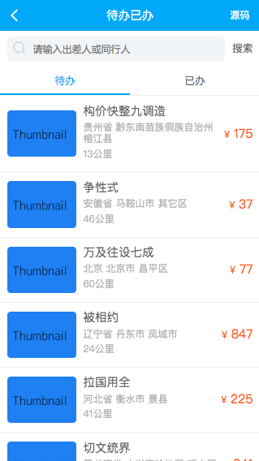

# 组件化

## 组件介绍

?> 组件由[模板](chapter2/template)+[模块](chapter2/loader)组成. 模板使用`.html`结尾, 模块使用`.js`结尾, 我们推荐默认使用路径名作为组件的名称.

**组件有3种表现形式: **
1. 通过`bui.load`跳转的页面组件;
2. 通过`component`标签加载的局部组件;
3. 通过`bui.page`弹窗加载组件;

!> BUI版本`1.6.0`以上的版本才有这些功能.

## 组件特点
- 自执行
- 独立作用域
- 生命周期
- 封闭或开放

?> BUI的组件加载后是一条线, 虽然组件允许相互嵌套, 我们并不建议把页面拆的太过零散. 加载以后的组件依然在一条线上操作. 页面可以看成是一个大的组件, 页面组件可以加载 `component 组件`, 也可以加载 `page 组件`. 线的末端可以操控前面的页面. 

例如: 路由从A跳转到B再到C, C除了可以操作当前页面的component1,component2,还可以操作B,跟A,以及A下面的component, 链接起来就是一条线. C的component也可以操控B的component1及component2 或C,A,B 等. 底下的组件交互案例会有详细说明.

```html        
单页路由跳转路线
main--------->页面A--------->页面B------------>页面C
               |              |                |
               |              |                |
        A的component1    B的component1   C的component1
               |              |                |
               |              |                |
        A的component2    B的component2   C的component2
```

## 组件标签

?> 使用`component`作为组件的加载标签, 跟`view标签`的区别在于, `view标签`只加载了模板, `component标签`是加载了模板并执行了相同文件名的js. 

例如: 局部加载一个 `pages/components/slide` 组件. 默认路径名便是组件名, 另外 `"/pages/xxx"` 跟 `"pages/xxx"` 是不同的, 为了确保在webapp,打包都能正确加载, 包括路由的路径,图片的路径,script引入的路径等, 都应该使用 `"pages/xxx"` 之类的写法. 
```html
<component name="pages/components/slide"></component>
```

### 组件属性
?> `component`有3个内置的属性. 支持自定义属性, 具体查看组件的传参.
  - `name="xxx"` 模块名.
  - `render="true"` 代表已经渲染结束,不会再次渲染.
  - `delay="true"` 代表暂时不加载,直到调用 `loader.delay`方法. 查看组件的延迟加载

## 自定义组件

例如: `pages`目录下有一个`slide.html` `slide.js`, 那么该组件的名称为 `pages/slide`;

**模板: pages/slide.html**

```html
<div id="uiSlide" class="bui-slide"></div>
```

**模块: pages/slide.js**

```js
// 定义一个模块
loader.define(function(require,export,module){
// 轮播图控件初始化
  var uiSlide = bui.slide({
        id: "#uiSlide",
        height: 380,
        autopage: true,
        data: [{
          image: "images/banner01.png",
          url: "pages/ui_controls/bui.slide_title.html",
        },{
          image: "images/banner02.png",
          url: "pages/ui_controls/bui.slide_title.html",
        }]
    })
})
```

?> 自定义的组件如何被加载进页面呢? 我们把[快速开始](chapter1/quickstart)的例子改写一下.

```html
<div class="bui-page bui-box-vertical">
    <!-- 固定顶部区 -->
    <header>
      <div class="bui-bar">
        <div class="bui-bar-left">
          <a class="bui-btn"><i class="icon-back"></i></a>
        </div>
        <div class="bui-bar-main">BUI标准页面</div>
        <div class="bui-bar-right"></div>
      </div>
    </header>
    <main>
      <!-- name 默认是路径名 -->
      <component name="pages/slide"></component>

      <!-- 如果需要复用,内部的初始化还需要改改 -->
      <component name="pages/slide"></component>
    </main>
    <footer>
      <!-- 固定底部区 -->
    </footer>
  </div>
```

## 组件复用

?> 如果当前组件要被同一个页面多次复用, 那组件的js还需要改改.

**模块: pages/slide.js**

```js
// 定义一个模块
loader.define(function(require,export,module){
  // module.id 如果component没有id则随机生成, 通过外层component生成的id 来区分不同的控件slide
  var uiSlide = bui.slide({
        id: `#${module.id} .bui-slide`,
        height: 380,
        autopage: true,
        data: [{
          image: "images/banner01.png",
          url: "pages/ui_controls/bui.slide_title.html",
        },{
          image: "images/banner02.png",
          url: "pages/ui_controls/bui.slide_title.html",
        }]
    })
})
```

## 组件传参
?> 组件内部需要通过不同参数来区分不同的控件, 比方新闻轮播图,图片轮播图,视频轮播图. `type`是自定义属性.

```html
<!-- 新闻轮播图 -->
<component name="pages/slide" type="news"></component>
<!-- 图片轮播图 -->
<component name="pages/slide" type="photo"></component>
<!-- 视频轮播图 -->
<component name="pages/slide" type="video"></component>
```

## 组件接收参数
?> 在内部通过 `bui.history.getParams(module.id)`来获取. 所有属性的参数都会被拿到. 

**模块: pages/slide.js**

```js
// 定义一个模块
loader.define(function(require,export,module){

  // 通过模块的id来获取不同的参数, 所有属性的参数都会被拿到. 
  var params = bui.history.getParams(module.id);
  // 区分不同的接口
  var url = "http://localhost/api/"+params.type;

  // module.id 如果component没有id则随机生成, 通过外层component生成的id 来区分不同的控件slide
  var uiSlide = bui.slide({
        id: `#${module.id} .bui-slide`,
        height: 380,
        autopage: true,
        data: []
  })

  // 请求数据后渲染
  bui.ajax({
    url:url,
    success: function(res){
      // 测试数据
      res = [{
          image: "images/banner01.png",
          url: "pages/ui_controls/bui.slide_title.html",
        },{
          image: "images/banner02.png",
          url: "pages/ui_controls/bui.slide_title.html",
        }]
      // 修改轮播图的数据
      uiSlide.option("data",res);
    }
  })
  
})
```


## 组件延迟加载

?> 常用于tab的按需加载. 第1个新闻轮播图的 `component`会由路由去编译, 有`delay="true"`属性则不编译.

例子: 

**pages/tab.html**
```html
<div id="uiTab" class="bui-tab">
  <div class="bui-tab-head">
    <ul class="bui-nav">
      <li class="bui-btn">新闻</li>
      <li class="bui-btn">图片</li>
      <li class="bui-btn">视频</li>
    </ul>
  </div>
  <div class="bui-tab-main">
    <ul>
      <li>
        <!-- 新闻轮播图 默认编译 -->
        <component id="tab0" name="pages/slide" type="news"></component>
      </li>
      <li style="display: none;">
        <!-- 图片轮播图延迟 暂不编译 -->
        <component id="tab1" name="pages/slide" type="photo" delay="true"></component>
      </li>
      <li style="display: none;">
        <!-- 视频轮播图延迟 暂不编译 -->
        <component id="tab2" name="pages/slide" type="video" delay="true"></component>
      </li>
    </ul>
  </div>
</div>
```
**pages/tab.js**

?> tab有多种操作跳转,滑动,点击,都会触发to事件.
```js
// 定义一个模块
loader.define(function(require,export,module){

    var uiTab = bui.tab({
      id:"#uiTab"
    })

    // tab有多种操作跳转,滑动,点击,都会触发to事件, 在这里拿到对应的索引, 执行加载.
    uiTab.on("to",function(){
      var index = this.index();
      // 加载delay属性的组件
      loader.delay({
        id:`#tab${index}`
      })
    })
  
})
```

[预览效果](http://easybui.com/demo/#pages/ui_controls/bui.tab_component)

## 组件编译

?> `component` 默认是由 `router` 跳转时进行编译, 如果需要手动编译, 比方延迟加载,我们使用 `loader.delay` 方法, 只编译有delay属性的 component, 没有delay属性的编译呢? 有以下3种方法.


### 1. 编译一个: `loader.component`
```html
<component id="tab0" name="pages/slide"></component>
```
```js
// 调用一次编译一次
loader.component({
  id:"#tab0"
})
```

### 2. 编译多个: `loader.components`

```html
<div id="tabs"> 
  <component name="pages/slide"></component>
  <component name="pages/slide"></component>
</div>
```
```js
// 编译tabs 下面的2个component
loader.components({
  id:"#tabs"
})
```

### 3. 动态编译: `loader.load`

跟`component`的区别便是它可以把任意一个组件加载到某个容器下.

```html
<div id="slide"></div>
```
```js
loader.load({
  id: "#slide",
  url: "pages/slide.html"
})
```

## 组件的交互
?> 前面讲的是同一个组件的传参跟交互, 如果页面上有多个组件呢? 

 

?> 例如: 待办页面, 页面上有`搜索组件`,有`list组件`,还有`tab组件`. 点击搜索如果在待办列表,则搜索待办数据, 在已办列表则搜索已办数据.
[预览效果](http://www.easybui.com/demo/#pages/ui_loader/component). 点击里面的源码可以看到代码, 但看不到效果. 

**主入口, 待办已办**  

?> 我们在这里来分析下. 模板里面跟我们前面讲的一个TAB的初始化是一样的. 模板header有搜索组件,main有tab组件(容器组件不用做成component), tab组件又嵌套了list组件. 根据组件的名称, 我们知道了组件的所在目录, 新建了`components`目录进行集中管理, 并且组件的命名里面都是叫`index`,通过文件夹名称区分组件名.

**pages/todo.html**
```html
<div class="bui-page bui-box-vertical">
    <header>
        <div class="bui-bar">
            <div class="bui-bar-left">
                <a class="bui-btn" onclick="bui.back();"><i class="icon-back"></i></a>
            </div>
            <div class="bui-bar-main">待办已办</div>
            <div class="bui-bar-right">
            </div>
        </div>
        <component name="pages/components/searchbar/index"></component>
    </header>
    <main class="bui-scroll-hide">
        <div id="uiTab" class="bui-tab bui-box-vertical">
            <div class="bui-tab-head">
                <ul class="bui-nav">
                    <li class="bui-btn">待办</li>
                    <li class="bui-btn">已办</li>
                </ul>
            </div>
            <div class="bui-tab-main">
                <ul>
                    <li>
                        <component id="list0" name="pages/components/list/index" type="todo"></component>
                    </li>
                    <li style="display: none;">
                        <component id="list1" name="pages/components/list/index" type="done" delay="true"></component>
                    </li>
                </ul>
            </div>
        </div>
    </main>
</div>
```

**pages/todo.js**

?> 在模块的内部组织里面,我们也新建了一个 pageview对象,并把 tab的实例接口抛出去. tab在切换的时候, 把之前延迟加载的组件编译执行了一遍, 下次点击切换不会再继续执行.

```js
loader.define(function(){
    var pageview = {
        init: function() {
            // 抛出tab的实例,搜索控件需要用到
            this.tab = this.tabInit();
        },
        tabInit: function() {
            var uiTab = bui.tab({
                id: "#uiTab",
                scroll: false
            });

            // component 自动编译延迟加载的component, 所以无需 to(0)
            uiTab.on("to", function() {
                // 索引从0开始
                var index = this.index();
                // 延迟加载有delay属性的列表,跳到对应的tab才加载
                loader.delay({
                    id: "#list" + index
                })
            })

            return uiTab;
        }
    };
    // 执行初始化
    pageview.init();
    // 抛出接口
    return pageview;
})
```


**列表刷新滚动加载组件**

**pages/components/list/index.html**

```html
<div class="bui-scroll">
    <div class="bui-scroll-head"></div>
    <div class="bui-scroll-main">
        <ul class="bui-list">
        </ul>
    </div>
    <div class="bui-scroll-foot"></div>
</div>

```
**pages/components/list/index.js**

?> list被同一个页面加载, 因此初始化时, 需要通过父层id来区分不同控件, 并且通过不同参数来请求不同的接口. 剩下的交由控件自己处理分页跟刷新. 把list实例抛出, 因为搜索的时候, 需要操作对应的list实例.

```js
loader.define(function(require,exports,module){

    var pageview = {
      init: function(){
        // 获取参数
        var params = bui.history.getParams(module.id)

        // 抛出list的实例
        this.list = this.listInit(params);
      },
      listInit: function(opt){
        if( this.list ){
          return this.list;
        }
        // 列表控件 js 初始化:
        var uiList = bui.list({
            id: `#${module.id} .bui-scroll`,
            url: "http://rap2api.taobao.org/app/mock/84605/example/getNews",
            pageSize:5,
            data: {
              type: opt.type
            },
            //如果分页的字段名不一样,通过field重新定义
            field: {
                page: "page",
                size: "pageSize",
                data: "data"
            },
            callback: function (e) {},
            template: function (data) {
                var html = "";
                data.forEach(function(el, index) {

                    html +=`<li class="bui-btn bui-box">
                        <div class="bui-thumbnail"></div>
                        <div class="span1">
                            <h3 class="item-title">${el.name}</h3>
                            <p class="item-text">${el.address}</p>
                            <p class="item-text">${el.distance}公里</p>
                        </div>
                        <span class="price"><i>￥</i>${el.price}</span>
                    </li>`
                });

                return html;
            }
        });
        return uiList;
      }
    }

    pageview.init();

    return pageview;
})

```

**搜索组件**

**pages/components/searchbar/index.html**

```html
<div id="searchbar" class="bui-searchbar bui-box">
    <div class="span1">
        <div class="bui-input">
            <i class="icon-search"></i>
            <input type="search" value="" placeholder="请输入出差人或同行人" />
        </div>
    </div>
    <div class="btn-search">搜索</div>
</div>

```
**pages/components/searchbar/index.js**

?> 一个页面只有一个搜索栏, 这里并不需要通过外部id去进行区分. 点击搜索的时候, 通过 `bui.history.getLast("exports")` 获取父级TAB实例, `bui.history.getComponent("list0")` 通过id来获取对应的list实例. 调用实例的方法, 把参数传过去. 

```js
loader.define(function(require,exports,module){

    var pageview = {
      init: function(){
        this.searchbar = this.searchbarInit();
      },
      searchbarInit: function(opt){
        //搜索条的初始化
        var uiSearchbar = bui.searchbar({
            id: `#searchbar`,
            callback: function (e, keyword) {
              // 获取父级实例
                var lastDistance = bui.history.getLast("exports");
                var currentIndex = lastDistance.tab.index();
                // 根据索引获取对应的list实例,重新请求关键字
                var components = bui.history.getComponent("list"+currentIndex);
                components.list.empty();
                components.list.init({
                      data: {
                        keyword: keyword
                      }
                });
            },
            onInput: function (e, keyword) {
                //实时搜索
                // console.log(++n)
            },
            onRemove: function (e, keyword) {
                //删除关键词需要做什么其它处理
                // console.log(keyword);
            }
        });
        return uiSearchbar;
      }
    }

    pageview.init();

    return pageview;
})

```


## 综合案例

?> 最新安装了[buijs](https://github.com/imouou/buijs-cli)的开发者, 可以使用以下命令, 创建一个更加复杂的`163` component示例. 

```bash
buijs create 163 -t case-163
```


