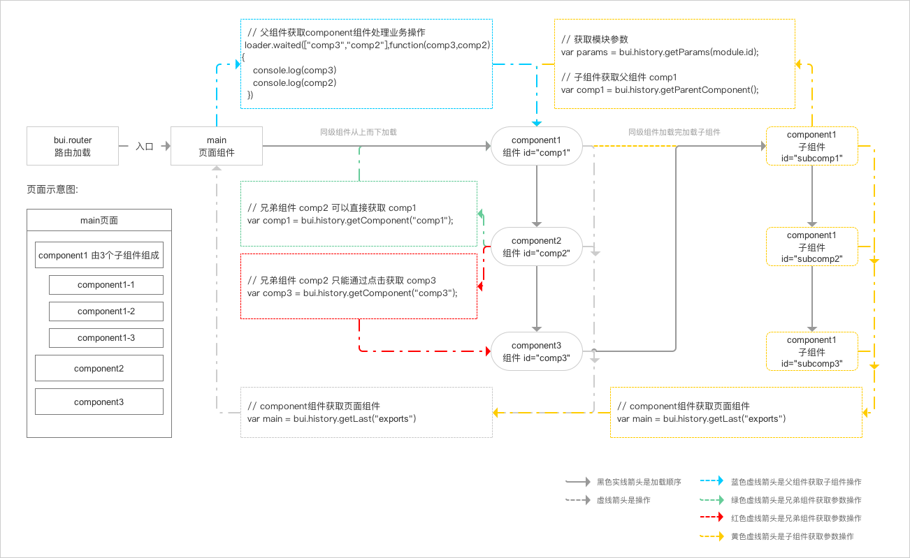

# 组件通讯

!> 以下内容基于BUI 1.6.2版本.

## 组件通讯图



路由初始化以后就会去找 `main` 入口页, 假设`main`由3个组件组成, 会依次,从上到下加载组件, 加载以后再递归查找子组件, 如此反复. (虽然默认组件允许嵌套组件, 但我们依然不建议把页面拆得太散. 组件应该是一个可以被自由加载,独立运行的个体. ) 


## 父组件传参给子组件

### 1. 静态传参

一进页面的时候就会编译, 这种组件应该是能够独立运行的.
```html
<component id="list" name="pages/components/list/index" type="news"></component>
```

### 2. 动态传参

组件需要通过请求以后才知道有哪些参数, 静态参数改变不会实时变更. 

```html
<component id="list" name="pages/components/list/index" delay="true"></component>
```

```js
// 点击或者请求以后才加载
$("#id").click(function(){
    // 动态加载组件
    loader.delay({
      id: "#list",
      param: {"type":"news"}
    })
})
```

### 3. 接收参数

list组件 **pages/components/list/index.js**

```js
loader.define(function(require,export,module){
    // 接收父级的传参
    var param = bui.history.getParams(module.id)
    // param.type = news
})

```

## 子组件获取父组件

list组件 **pages/components/list/index.js**

```js
loader.define(function(require,export,module){
    // 1.6.1 的方式
    var params = bui.history.getParams(module.id);
    var parentComp = bui.history.getComponent(params.parentId);

    
    // 1.6.2 的方式
    var parentComp = bui.history.getParentComponent();
    // 拿到父组件return 出来的方法, 就可以操作父组件.

})
```

?> 如果列表组件没有被嵌套加载, 拿到的父组件为`页面组件`, 嵌套则是拿到上一级组件.

## 子组件获取页面组件

list组件 **pages/components/list/index.js**

```js
loader.define(function(require,export,module){
    // 无论被嵌套多少层都可以直接获取到页面组件
    var pageComp = bui.history.getLast("exports");

})
```

## 兄弟组件

?> 比方页面由 `搜索组件`, `列表组件` 组成, 点击搜索, 要操作列表的方法重新带上关键字请求;

页面组件
**pages/main/main.html**

```html
<div class="bui-page bui-box-vertical">
  <header></header>
  <main>
      <!-- 搜索组件 -->
      <component id="search" name="pages/components/searchbar/index"></component>
      <!-- 列表组件 -->
      <component id="list" name="pages/components/list/index"></component>
  </main>
</div>
```


search组件 **pages/components/search/index.js**


```js
loader.define(function(require,export,module){
    var pageview = {
      init: function(){
        // 这样是获取不到list组件的 refresh 方法, 因为list比search晚加载.
        // var list = bui.history.getComponent("list");

        router.$("#btnSearch").click(function(){

            // 在点击的时候可以获取到兄弟list组件.
            var list = bui.history.getComponent("list");

            // 获取搜索的关键字
            var keyword = router.$(".search-input").val();
            
            // 调用列表组件的局部属性方法, 把关键字传过去.
            list.refresh(keyword);
        })
      }
    }
    // 初始化
    pageview.init();
    return pageview
})

```

list组件 **pages/components/list/index.js**

```js
loader.define(function(require,export,module){
    var pageview = {
      init: function(){

      },
      refresh: function(keyword){
        // 接收到搜索传来的关键字进行请求操作
        console.log(keyword)
      }
    }
    // 初始化
    pageview.init();
    return pageview
})

```
!> 注意, 搜索组件在初始化直接获取list组件, 会获取不到, 因为list比search晚加载.


## 父组件获取子组件

?> 父组件获取子组件由于加载顺序, 如果组件被重复加载,那就会重复触发 `one`里面的回调. 应该尽量避免这种操作.

### 1. 页面组件获取子组件

main页面组件: ** pages/main/main.html **

```html
<component id="searchbar" name="pages/components/searchbar/index"></component>
<component id="list" name="pages/components/list/index"></component>
```

** pages/main/main.js **
```js
loader.define(function(){
    // 监听 多个子组件加载完成就会触发一次
    loader.wait(["searchbar","list"],function(searchbar,list){
      // 拿到子组件实例操作
      console.log(searchbar.exports)
      console.log(list.exports)
    })
})
```

### 2. 自定义事件获取

main页面组件: ** pages/main/main.html **

```html
<component id="list" name="pages/components/list/index"></component>
```

** pages/main/main.js **
```js
loader.define(function(require,export,module){

    // 监听页面点击了搜索以后的操作
    loader.on("click-search",function(mod){
      // 拿到子组件操作
      mod.refresh();
    })
})
```

** pages/components/list/index.js **
```js
loader.define(function(require,export,module){
    var pageview = {
      init: function(){
        // 绑定点击事件
        router.$(".btn-search").click(function(){

          // 组件加载完成以后触发自定义事件, 把对象传给父组件操作.
          loader.trigger("click-search","传过去的参数");
        })
      },
      refresh: function(){
        console.log("list refresh")
      }
    }

    // 初始化
    pageview.init();

    return pageview;
})
```


## 综合案例
?> 搜索跟列表组件跟页面组件相互操作的案例.

<iframe width="320" height="560" src="http://www.easybui.com/demo/#pages/ui_loader/component" allowfullscreen="allowfullscreen" frameborder="0"></iframe>

?> 例如: 待办页面, 页面上有`搜索组件`,有`list组件`,还有`tab组件`. 点击搜索如果在待办列表,则搜索待办数据, 在已办列表则搜索已办数据.
[预览效果](http://www.easybui.com/demo/#pages/ui_loader/component). 点击里面的源码可以看到代码, 但看不到效果. 


**主入口, 待办已办**  

?> 我们在这里来分析下. 模板里面跟我们前面讲的一个TAB的初始化是一样的. 模板header有搜索组件,main有tab组件(容器组件不用做成component), tab组件又嵌套了list组件. 根据组件的名称, 我们知道了组件的所在目录, 新建了`components`目录进行集中管理, 并且组件的命名里面都是叫`index`,通过文件夹名称区分组件名.


**pages/main/main.html**
```html
<div class="bui-page bui-box-vertical">
    <header>
        <div class="bui-bar">
            <div class="bui-bar-left">
                <a class="bui-btn" onclick="bui.back();"><i class="icon-back"></i></a>
            </div>
            <div class="bui-bar-main">待办已办</div>
            <div class="bui-bar-right">
            </div>
        </div>
        <component name="pages/components/searchbar/index"></component>
    </header>
    <main class="bui-scroll-hide">
        <div id="uiTab" class="bui-tab bui-box-vertical">
            <div class="bui-tab-head">
                <ul class="bui-nav">
                    <li class="bui-btn">待办</li>
                    <li class="bui-btn">已办</li>
                </ul>
            </div>
            <div class="bui-tab-main">
                <ul>
                    <li>
                        <component id="list0" name="pages/components/list/index" type="todo"></component>
                    </li>
                    <li style="display: none;">
                        <component id="list1" name="pages/components/list/index" type="done" delay="true"></component>
                    </li>
                </ul>
            </div>
        </div>
    </main>
</div>
```

**pages/main/main.js**

?> 在模块的内部组织里面,我们也新建了一个 pageview对象,并把 tab的实例接口抛出去. tab在切换的时候, 把之前延迟加载的组件编译执行了一遍, 下次点击切换不会再继续执行.

```js
loader.define(function(){
    var pageview = {
        init: function() {
            // 抛出tab的实例,搜索控件需要用到
            this.tab = this.tabInit();
        },
        tabInit: function() {
            var uiTab = bui.tab({
                id: "#uiTab",
                scroll: false
            });

            // component 自动编译延迟加载的component, 所以无需 to(0)
            uiTab.on("to", function() {
                // 索引从0开始
                var index = this.index();
                // 延迟加载有delay属性的列表,跳到对应的tab才加载
                loader.delay({
                    id: "#list" + index
                })
            })

            return uiTab;
        }
    };
    // 执行初始化
    pageview.init();
    // 抛出接口
    return pageview;
})
```


**列表刷新滚动加载组件**


**pages/components/list/index.html**

```html
<div class="bui-scroll">
    <div class="bui-scroll-head"></div>
    <div class="bui-scroll-main">
        <ul class="bui-list">
        </ul>
    </div>
    <div class="bui-scroll-foot"></div>
</div>

```
**pages/components/list/index.js**

?> list被同一个页面加载, 因此初始化时, 需要通过父层id来区分不同控件, 并且通过不同参数来请求不同的接口. 剩下的交由控件自己处理分页跟刷新. 把list实例抛出, 因为搜索的时候, 需要操作对应的list实例.

```js
loader.define(function(require,exports,module){

    var pageview = {
      init: function(){
        // 获取参数
        var params = bui.history.getParams(module.id)

        // 抛出list的实例
        this.list = this.listInit(params);
      },
      listInit: function(opt){
        if( this.list ){
          return this.list;
        }
        // 列表控件 js 初始化:
        var uiList = bui.list({
            id: `#${module.id} .bui-scroll`,
            url: "http://rap2api.taobao.org/app/mock/84605/example/getNews",
            pageSize:5,
            data: {
              type: opt.type
            },
            //如果分页的字段名不一样,通过field重新定义
            field: {
                page: "page",
                size: "pageSize",
                data: "data"
            },
            callback: function (e) {},
            template: function (data) {
                var html = "";
                data.forEach(function(el, index) {

                    html +=`<li class="bui-btn bui-box">
                        <div class="bui-thumbnail"></div>
                        <div class="span1">
                            <h3 class="item-title">${el.name}</h3>
                            <p class="item-text">${el.address}</p>
                            <p class="item-text">${el.distance}公里</p>
                        </div>
                        <span class="price"><i>￥</i>${el.price}</span>
                    </li>`
                });

                return html;
            }
        });
        return uiList;
      }
    }

    pageview.init();

    return pageview;
})

```

**搜索组件**


**pages/components/searchbar/index.html**

```html
<div id="searchbar" class="bui-searchbar bui-box">
    <div class="span1">
        <div class="bui-input">
            <i class="icon-search"></i>
            <input type="search" value="" placeholder="请输入出差人或同行人" />
        </div>
    </div>
    <div class="btn-search">搜索</div>
</div>

```
**pages/components/searchbar/index.js**

?> 一个页面只有一个搜索栏, 这里并不需要通过外部id去进行区分. 点击搜索的时候, 通过 `bui.history.getLast("exports")` 获取父级TAB实例, `bui.history.getComponent("list0")` 通过id来获取对应的list实例. 调用实例的方法, 把参数传过去. 

```js
loader.define(function(require,exports,module){

    var pageview = {
      init: function(){
        this.searchbar = this.searchbarInit();
      },
      searchbarInit: function(opt){
        //搜索条的初始化
        var uiSearchbar = bui.searchbar({
            id: `#searchbar`,
            callback: function (e, keyword) {
              // 获取父级实例
                var lastDistance = bui.history.getLast("exports");
                var currentIndex = lastDistance.tab.index();
                // 根据索引获取对应的list实例,重新请求关键字
                var components = bui.history.getComponent("list"+currentIndex);
                components.list.empty();
                components.list.init({
                      data: {
                        keyword: keyword
                      }
                });
            },
            onInput: function (e, keyword) {
                //实时搜索
                // console.log(++n)
            },
            onRemove: function (e, keyword) {
                //删除关键词需要做什么其它处理
                // console.log(keyword);
            }
        });
        return uiSearchbar;
      }
    }

    pageview.init();

    return pageview;
})

```

## 最终效果

通过上面几个文件的代码, 就可以轻松实现`下拉刷新`,`滚动加载下一页`,`tab切换`,`自动根据选项卡触发列表搜索`,`删除关键字`等功能.

