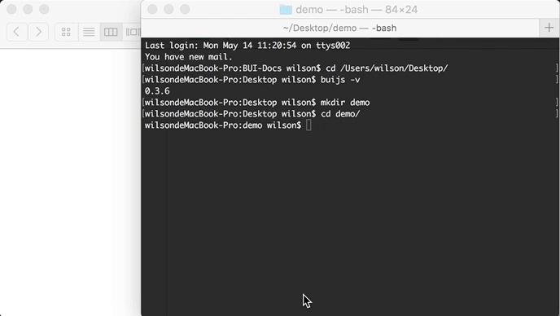
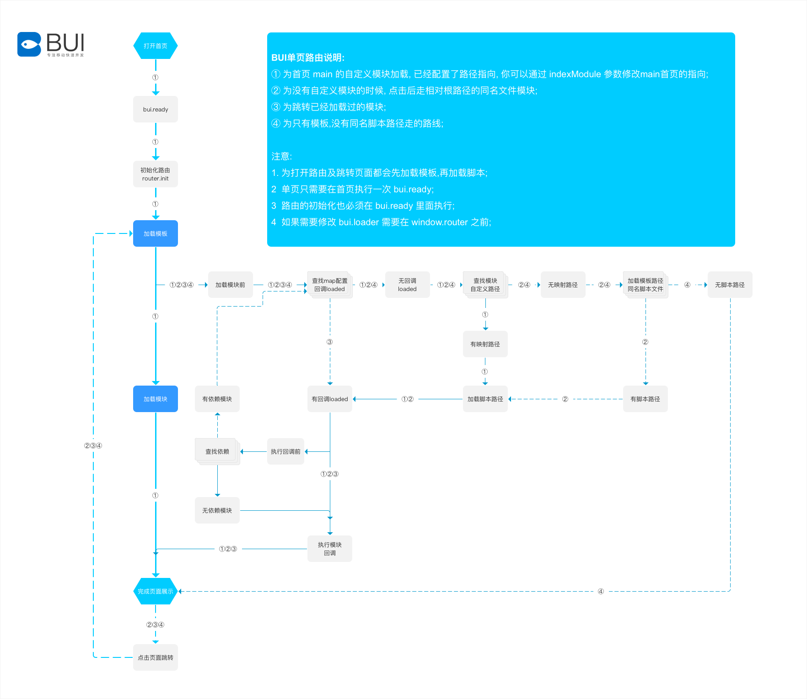

# 单页路由


## 前言

?> 单页路由可以实现对路由的复杂操作, 弥补多页开发的不足, 在体验上, 效果也会更佳. 从多页转单页开发, 保持了接口的一致性, 上手非常简单, 但需要你对模块化也有一定的了解.

### 效果预览


[点击这里体验](http://www.easybui.com/demo/#pages/router/index)

### 路由功能

* 页面跳转,支持html跳转或者模块跳转;
* 支持选择不同动画,融入不同平台的切换效果;
* 支持预加载;
* 支持页面刷新;
* 支持当前页面替换;
* 支持页面的局部加载;
* 支持页面传参,获取参数;
* 支持指定跳入某个页面;
* 支持缓存,默认已经配置;
* 支持展示进度条,需要配置;
* 支持后退刷新;
* 支持后退多层;
* 支持后退到指定模块;
* 支持物理后退按键;


## 创建单页工程 

?> 使用`buijs`命令行构建. <a href="https://github.com/imouou/buijs-cli" target="_blank">如何使用buijs命令行工具?</a>

 

### 创建demo工程
```bash
# 创建目录
$ mkdir demo

# 进入demo目录
$ cd demo

# 创建单页工程
$ buijs create
```

### 安装依赖及预览
```bash
# 安装工程依赖
$ npm install
# 运行服务并预览
$ npm run dev
```

### 目录规范

  

**目录说明:**

| **目录名**   | **描述**               | **是否必须**               |
|:------------- |:--------------------------------|--------------:|
| /app.json | 插件及跨域的配置        | 否 |
| /gulpfile.js | gulp编译配置        | 否 |
| /package.json | 工程依赖配置        | 否 |
| /src/index.html | 应用首页入口文件        | 是 |
| /src/index.js   | 路由的初始化脚本及全局事件     | 是 |
| /src/css/       | 应用样式及bui.css样式        | 是 |
| /src/font/      | bui.css用到的字体图标        | 是 |
| /src/images/       | 应用图片目录        | 否 |
| /src/js/       | 应用脚本        | 是 |
| /src/js/zepto.js   | bui.js默认依赖于zepto.js 或 jquery      | 是 |
| /src/js/bui.js     | BUI交互控件库        | 是 |
| /src/pages/       | 应用的模块        | 是 |
| /src/pages/main/       | 默认路由初始化以后会先载入这个main模块        | 是 |
| /src/pages/main/main.html | main模块的模板        | 是 |
| /src/pages/main/main.js   | main模块的业务脚本     | 是 |

----

## 路由初始化

*打开编辑 `src/index.html` , body 下只有一个div,这个便是路由最外层结构.*

*src/index.html*

```html
<!DOCTYPE HTML>
<html lang="en-US">
<head>
    <meta http-equiv="Content-Type" content="text/html;charset=UTF-8" />
    <title>BUI单页工程</title>
    <meta name="format-detection" content="telephone=no" />
    <meta name="viewport" content="width=device-width, initial-scale=1, maximum-scale=1, minimum-scale=1, user-scalable=no">
    <link rel="stylesheet" href="css/bui.css" />
</head>

<body>
    <!-- 第1步: 开启单页路由 -->
    <div id="bui-router"></div>
    <script src="js/zepto.js"></script>
    <script src="js/bui.js"></script>
    <!-- 初始化单页 -->
    <script src="index.js"></script>
</body>

</html>
```

*src/index.js *

```js
// 把路由实例化给 window.router 
window.router = bui.router();

bui.ready(function(){

    // 加载页面到div容器里面, 更多参数请查阅API
    router.init({
        id: "#bui-router"
    })
})
```

?> 当路由初始化以后,会自动查找首页`main`模块, 这个模块是内部定义好的, 默认指向路径 `pages/main/main.html` 并`自动加载`相同名字的`js文件`. 除了`main`, 正常我们都是创建匿名模块,这样只要通过路径跳转,就会自动加载相对路径同名的模块.

### 模块名: main
*src/pages/main/main.html*

```html
<div class="bui-page">
    <header class="bui-bar">
        <div class="bui-bar-left">
        </div>
        <div class="bui-bar-main">main</div>
        <div class="bui-bar-right">
        </div>
    </header>
    <main>
      <div id="btn" class="bui-btn">跳转page2.html</div>
    </main>
    <footer></footer>
</div>
```
*src/pages/main/main.js*

```js
loader.define(function(require,exports,module){
    // 绑定按钮跳转
    $("#btn").on("click",function(){
      router.load({ url: "pages/page2/page2.html", param: {} });
    })
})

```

### pages/page2/page2模块

?> 我们再创建一个 `src/pages/page2/page2.html`,及 `src/pages/page2/page2.js` ,那通过下面的方式跳转,则创建了一个 `src/pages/page2/page2` 的模块.

*src/pages/page2/page2.html*

```html
<div class="bui-page">
    <header class="bui-bar">
        <div class="bui-bar-left">
        </div>
        <div class="bui-bar-main">page2</div>
        <div class="bui-bar-right">
        </div>
    </header>
    <main></main>
    <footer></footer>
</div>
```

*src/pages/page2/page2.js*

```js
loader.define(function(require,exports,module){
  // 脚本都需要在这里执行

})

```

*注意:*

- 页面已经加载过,应该使用后退操作, 例如,上面的例子,在pages2.html,不要使用 router.load({url:"main"}) 这样跳回首页, 使用 `router.back`;

----


## 路由原理

?> 这就是一个简单的路由跳转过程. 




## 页面跳转
### router.load(option) 

?> 页面跳转,保持js跟html一致的命名,才能自动加载触发. 同样支持 `bui.btn` 静态跳转

*参数: option是一个对象 *

#### option.url
- Type: `string`
- Detail: `相对路径`

#### option.param
- Type: `object`
- Detail: `传给目标页面的参数`

*例子:*

```js
router.load({ url: "pages/page2/page2.html", param: {} });
```

!> 注意: 仔细查看下跟多页路由接口都是保持的一致,甚至你可以直接使用 `bui.load` 来代替 `router.load` , 这个也是最早我们推荐的方式, 所以你会看到部分例子还是保持这样的写法. 现在我们更推荐您使用 `router.load` 等统一单页路由的接口.


## 接收参数
### router.getPageParams 

?> 接收到的参数为一个对象, 无需在回调里面拿. 

*例子:*

```js
var params = router.getPageParams();
```

## 页面后退
### router.back(option) 

?> router.back 跟 bui.back 的区别在于, bui.back 后退会把历史记录一起后退,router.back 只是后退页面. 正常建议使用 bui.load 及 bui.back.

*参数: option是一个对象 *

#### option.index
- Type: `number`
- Detail: `后退几层,默认:-1`

#### option.name
- Type: `string`
- Detail: `后退到指定的模块名, name跟index,只能有一个`

#### option.callback
- Type: `function`
- Detail: `后退以后执行回调`

*例子:*
```js
// 普通后退
router.back();

// 后退2层刷新
router.back({
  index: -2,
  callback: function(){
    router.refresh()
  }
});

// 后退局部刷新
router.back({
  callback: function(module){
    // 后退的页面有抛出一个init方法
    module.init();
  }
});

// 不管在哪层,都可以后退到首页
router.back({
  name: "main"
});
```

## 页面刷新
### router.refresh 

?> 页面刷新有可能造成事件重复绑定, 所以一般不建议这样使用. 可以结合 `loader.require` 调用模块抛出的方法, 实现局部刷新功能. 

*例子:*

```js
router.refresh();
```

## 页面替换
### router.replace(option) 

?> 页面替换不会增加历史记录

*参数: option是一个对象 *

#### option.url
- Type: `string`
- Detail: `相对路径`

#### option.param
- Type: `object`
- Detail: `传给目标页面的参数`

*例子:*

```js
router.replace({ url: "pages/page3/page3.html" });
```

## 局部加载模块
### router.loadPart 

*参数: option是一个对象 *

#### option.id
- Type: `string|object`
- Detail: `局部的id或者对象`

#### option.url
- Type: `string`
- Detail: `相对路径`

#### option.param
- Type: `object`
- Detail: `传给目标页面的参数`

*例子:*

```js
router.loadPart({ id:"#part", url: "pages/page2/page2.html", param: {} });

```

## 局部接收参数
### router.getPartParams(moduleName)

*参数: *

#### moduleName
- Type: `string`
- Detail: `模块的名称`

*例子:*

```js
loader.define(function(require,exports,module) {
  // module 为当前的模块信息
   var pid = module.moduleName,
       params = router.getPartParams(pid);

 })

```

## 预加载
### router.preload(option)

?> 如果你的应用是webapp,那这个功能就比较好用了,先在首页预加载想要触发的页面, 当点击触发相同页面的时候, 你会发现跳转速度快多了, 本地应用则无需使用到预加载. 

*参数: option是一个对象 *

#### option.url
- Type: `string`
- Detail: `缓存模板`

#### option.script
- Type: `string`
- Detail: `缓存脚本`

```js
// 预加载一个页面
router.preload({ url: "pages/page2/page2.html" });

// 预加载多个页面
router.preload([{ 
  url: "pages/page2/page2.html" 
},{ 
  url: "pages/page3/page3.html" 
}]);

```


## 页面重复加载

?> 页面重复加载的表现通常是, 渲染出不来,要刷新才有数据.

### 使用 router.$ 替换 $ 选择器

?> `router.$` 跟 `$`的区别在于, router.$ 是相对于当前页面查找, 有一种情况, 页面需要被重复加载, 比方列表页,跳转到详情页,详情页又有推荐的列表,点击又会跳转到详情, 这种时候,`$`绑定页面的事件会被重复绑定, `router.$` 则不会.


*事件绑定示例: *
```js

// 绑定当前页面下样式为 btn 的事件
router.$(".bui-page").on("click",".btn",function(e){
  
})
```

!> 另外,建议一个单页应用的层级建议控制在 5级左右. 已经加载过的页面,使用后退刷新处理. 例如: 

```
// 推荐: 这也是微信小程序里面推荐的层级数
A->B->C->D->E 

// 不要这样, 这种做法本身会让用户陷入混乱
A->B->C->B->C
```

## 获取历史记录

### router.history.get()

?> 获取当前路由的历史记录

```js
  var routerHistory = router.history.get();
```

### router.history.getLast()
?> 获取路由的最后一条记录

```js
  var routerLastHistory = router.history.getLast();
```

----


## 路由全局事件

### load 事件
?> 页面加载,在模板加载完成就会触发,有缓存的时候只触发一次

```js
router.on("load",function(e){
  // 获取当前页的模块
  console.log(e.target);
  // 获取上一页的模块
  console.log(e.prevTarget);
})
```

### complete 事件
?> 页面完成,每次加载完模板都会触发

```js
router.on("complete",function(e){
  // 获取当前页的模块
  console.log(e.target);
  // 获取上一页的模块
  console.log(e.prevTarget);
})
```

### back 事件

```js
router.on("back",function(e){
  // 获取当前页的模块
  console.log(e.target);
  // 获取上一页的模块
  console.log(e.prevTarget);
})
```

### refresh 事件

```
router.on("refresh",function(e){
  // 获取当前页的模块
  console.log(e.target);
  // 获取上一页的模块
  console.log(e.prevTarget);
})
```
### loadpart 事件

?> 页面局部加载后触发

```
router.on("loadpart",function(e){
  // 获取当前页子模块
  console.log(e.target);
  // 获取当前页父模块
  console.log(e.prevTarget);
})
```

!> 注意: 建议全局事件都在 index.js 加载. 事件名全部为小写.


?> 接下来你可以继续学习

- [模块化](chapter2/loader)
- [微信Webapp开发的各种变态路由需求及解决办法!](https://segmentfault.com/a/1190000015493097)
